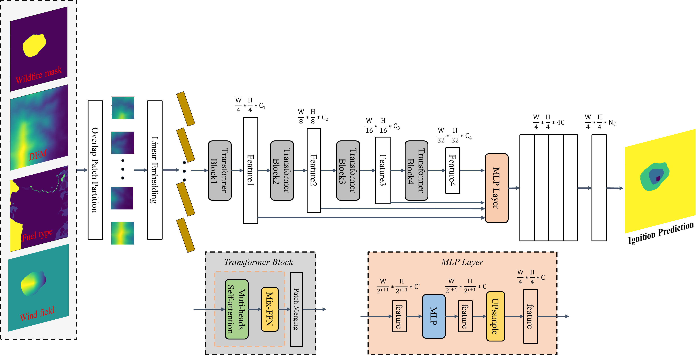
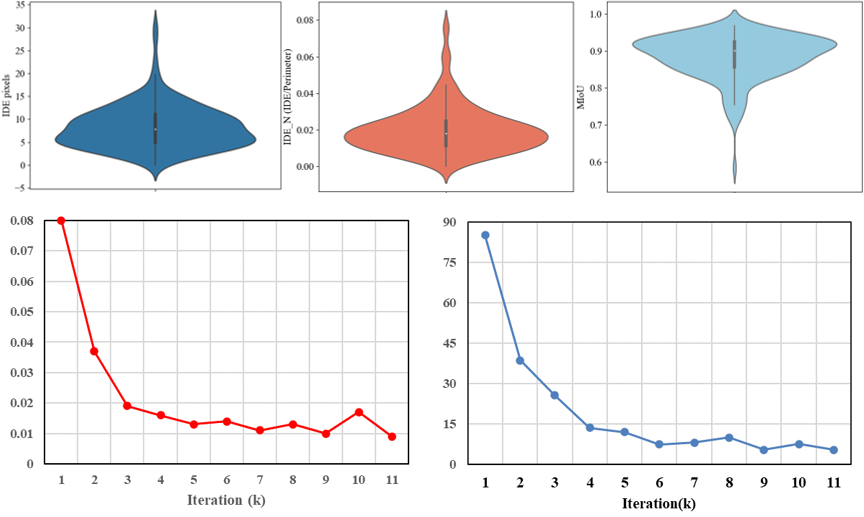
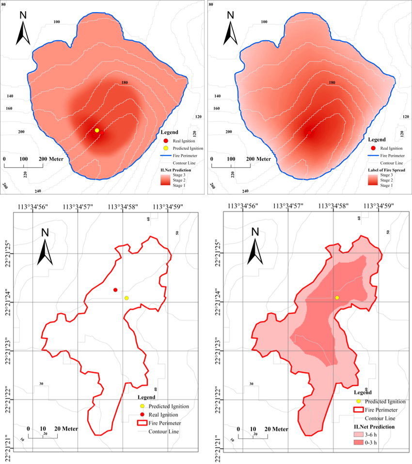

# A transformer-based neural network for ignition location prediction from the final wildfire perimeter
- This is the official implementation of our manuscript submitted to environmental modelling & software
- Data was saved in dir 'data' and recommended grid resolution is 512*512. We show one example data here
- Dir 'pth' was used to save model weights while training
- data_util_forsegformer.py was used to load the training and test data for our ILNet.
- train_segformer.py was the main python document for training ILNet
- EVALnew.py was used to evaluate the model performance on test dataset.
- Our ILNet framework was shown below
- 
- Our evaluated metrics was shown below
- 
- Here are samples of our predicted ignition location and label data
- 
